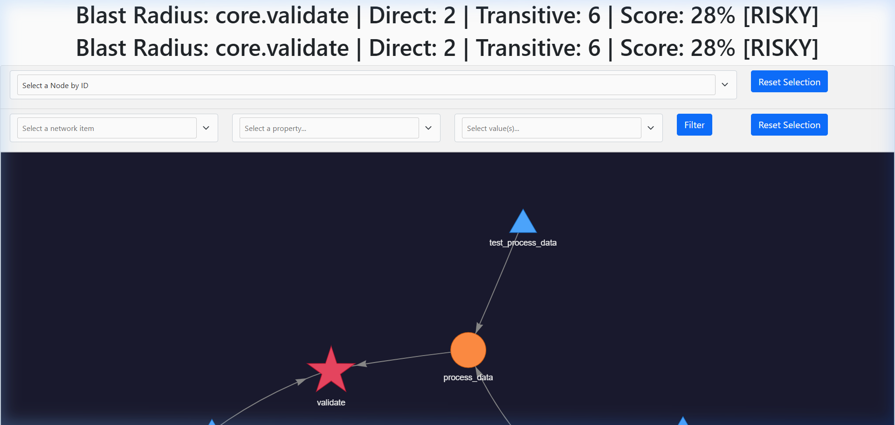
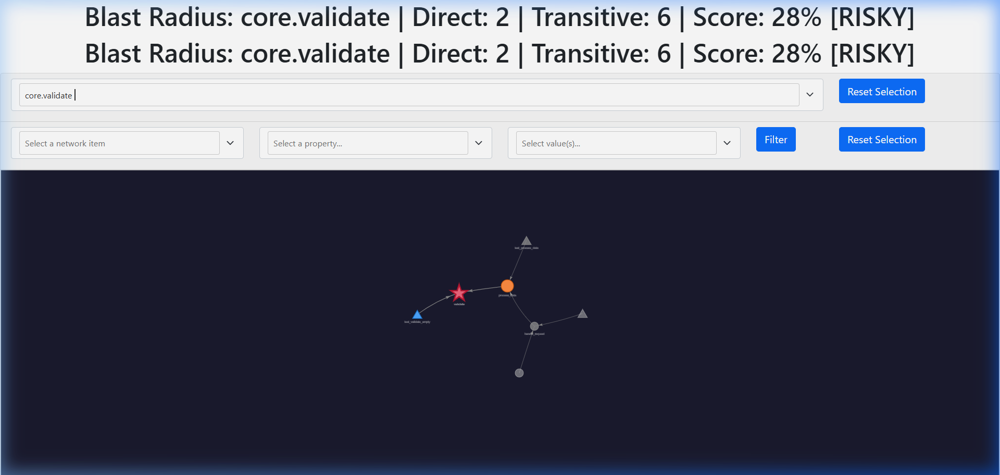

# Blast Radius Mapper

[](https://github.com/aquasimp/blast-radius-mapper/actions/workflows/ci.yml)

**Map the impact of Python code changes before you make them.**

A fully local, function-level static analysis tool that shows you exactly what breaks when you touch a function — direct callers, transitive dependents across the full call chain, test coverage gaps, and a confidence score for making the change safely.



---

## Why This Exists

Changing a function in a large Python codebase is risky. Import-level tools (`pipdeptree`, IDE "Find Usages") miss the real picture:

- They don't trace **function-level** call chains across modules
- They don't tell you which affected paths are **covered by tests**
- They don't quantify **how safe** the change actually is
- They can't show you the **full blast radius** in one view

Blast Radius Mapper does all four, completely offline, with zero cloud dependencies.

---

## Features

| Feature | Description |
|---------|-------------|
| **Function-level call graph** | Traces `who calls what` across your entire codebase, not just imports |
| **Transitive impact analysis** | Follows the full call chain: if A calls B calls C, changing C shows A |
| **Test coverage integration** | Maps `coverage.py` data to individual functions, not just files |
| **Confidence scoring** | 5-factor weighted score (0–100%) that quantifies change safety |
| **Interactive visualization** | Dark-themed, force-directed HTML graph you can explore in a browser |
| **Class hierarchy (C3 MRO)** | Correctly resolves `self.method()` and `super()` through diamond inheritance |
| **Dead code detection** | Flags orphan functions with zero callers (secondary signal) |
| **JSON output** | Machine-readable reports for CI integration |
| **Tree-sitter fallback** | Parses files with syntax errors when `ast` can't |
| **Fully local** | No cloud APIs, no LLMs, no network calls. Your code stays on your machine. |

---

## Quick Start

### Install

```bash
# Clone the repository
git clone https://github.com/aquasimp/blast-radius-mapper.git
cd blast-radius-mapper

# Install in development mode
pip install -e ".[dev]"
```

### Analyze a function

```bash
blast-radius analyze ./myproject --function myproject.utils.retry
```

Output:
```
======================================================================
  BLAST RADIUS ANALYSIS
======================================================================
  Target:      myproject.utils.retry
  Confidence:  72% - [MODERATE]
  Direct:      4 callers
  Transitive:  12 dependents
  Tests:       6 covering tests
  Graph:       blast_radius.html

  Direct Callers:
    [+++] [########--]   80% myproject.api.fetch_data
    [++ ] [#####-----]   50% myproject.core.process
    [   ] [----------]    0% myproject.handlers.webhook
    [   ] [----------]    0% myproject.tasks.background_sync
======================================================================
```

### With coverage data

```bash
# Generate coverage data first
coverage run -m pytest
coverage json -o coverage.json

# Then analyze with coverage
blast-radius analyze ./myproject \
  --function myproject.utils.retry \
  --coverage coverage.json \
  --json report.json \
  --dead-code
```

### List all functions

```bash
blast-radius list ./myproject
blast-radius list ./myproject --format json
```

### Generate full project graph

```bash
blast-radius graph ./myproject --output full_graph.html
```

---

## Interactive Graph

The HTML graph is fully interactive:



### Node encoding

| Shape | Color | Meaning |
|-------|-------|---------|
| ★ Star | Red | **Target function** — the one you're changing |
| ● Circle | Orange | **Direct callers** — functions that call the target |
| ▲ Triangle | Blue | **Test functions** — tests covering the blast radius |
| ● Circle | Red → Green gradient | **Transitive dependents** — color = coverage level |

### Edge encoding

| Style | Meaning |
|-------|---------|
| Solid gray | High confidence edge (≥ 80%) |
| Dashed dim | Low confidence edge (< 80%) — may be an indirect reference |

### Interactive features

- **Hover** any node to see its FQN, depth, coverage %, and type
- **Drag** nodes to rearrange the layout
- **Select by ID** using the dropdown at the top
- **Filter** by network item, property, or value
- **Zoom/pan** with scroll and drag

---

## Confidence Score

The confidence score is a weighted combination of five factors:

| Factor | Weight | What it measures |
|--------|--------|-----------------|
| Target coverage | 25% | Is the function you're changing covered by tests? |
| Dependent coverage | 25% | Are the downstream functions covered? |
| Fan-out penalty | 20% | How many direct callers? (logarithmic penalty) |
| Depth penalty | 15% | How deep is the transitive chain? |
| Test reachability | 15% | What fraction of the blast radius is reachable from tests? |

### Risk labels

| Score | Label | Meaning |
|-------|-------|---------|
| ≥ 80% | `[SAFE]` | Well-tested, small blast radius |
| 50–79% | `[MODERATE]` | Some coverage gaps or moderate fan-out |
| 20–49% | `[RISKY]` | Significant gaps — review carefully |
| < 20% | `[DANGEROUS]` | Untested code with wide blast radius |

---

## Architecture

```
                    ┌──────────┐
                    │  CLI     │
                    └────┬─────┘
                         │
                    ┌────▼─────┐
                    │ Pipeline │  (13-phase orchestrator)
                    └────┬─────┘
                         │
         ┌───────────────┼───────────────┐
         │               │               │
    ┌────▼────┐    ┌─────▼─────┐   ┌─────▼──────┐
    │ Scanner │    │ Extractor │   │  Resolver   │
    │         │    │   (AST)   │   │ (imports)   │
    └────┬────┘    └─────┬─────┘   └─────┬───────┘
         │               │               │
         │          ┌────▼──────────────▼──┐
         └─────────►│    Symbol Table       │
                    │  (C3 MRO registry)    │
                    └──────────┬────────────┘
                               │
                    ┌──────────▼────────────┐
                    │     Call Graph         │
                    │ (edge extraction)      │
                    └──────────┬────────────┘
                               │
              ┌────────────────┼────────────────┐
              │                │                │
        ┌─────▼─────┐  ┌──────▼──────┐  ┌──────▼──────┐
        │  Analyzer  │  │  Coverage   │  │   Scorer    │
        │ (BFS trace)│  │ Integrator  │  │ (5-factor)  │
        └─────┬──────┘  └──────┬──────┘  └──────┬──────┘
              │                │                │
              └────────────────┼────────────────┘
                               │
                    ┌──────────▼────────────┐
                    │      Renderer         │
                    │  (pyvis HTML graph)   │
                    └───────────────────────┘
```

### Two-pass design

1. **Discovery pass**: Scan files → parse ASTs → extract definitions → build symbol table
2. **Resolution pass**: Resolve imports → compute MRO → extract call edges → trace impact

This avoids circular dependency issues where module A imports from B which imports from A.

---

## What It Handles

### Call patterns resolved

| Pattern | Example | Resolution |
|---------|---------|------------|
| Simple call | `foo()` | Direct FQN lookup |
| Method call | `self.process()` | MRO-based resolution |
| Super call | `super().validate()` | MRO walk (skip current class) |
| Module call | `utils.retry()` | Import alias → FQN |
| Constructor | `MyClass()` | → `MyClass.__init__` |
| Attribute chain | `self.client.send()` | Best-effort resolution |
| Static/classmethod | `MyClass.create()` | Direct class FQN |

### Import patterns resolved

| Pattern | Example |
|---------|---------|
| `import X` | `import os` |
| `import X as Y` | `import numpy as np` |
| `from X import Y` | `from pathlib import Path` |
| `from X import Y as Z` | `from collections import OrderedDict as OD` |
| `from . import X` | Relative imports |
| `from .X import Y` | Relative sub-module imports |
| `from X import *` | Star imports (uses `__all__` when available) |

### Class hierarchy

Full C3 linearization (the same algorithm CPython uses for `__mro__`). Correctly handles:

- Single inheritance
- Multiple inheritance
- Diamond inheritance
- Complex mixin hierarchies

---

## Project Structure

```
blast-radius-mapper/
├── src/blast_radius_mapper/
│   ├── __init__.py
│   ├── models.py              # FQN, FunctionInfo, ClassInfo, ImpactResult
│   ├── logging_config.py      # Structured logging
│   ├── utils.py               # AST helpers, test file detection
│   ├── scanner.py             # File discovery + module path mapping
│   ├── extractor.py           # AST-based definition extraction
│   ├── symbol_table.py        # Multi-index registry + C3 MRO
│   ├── resolver.py            # Import resolution (7 patterns)
│   ├── call_graph.py          # Call edge extraction + resolution
│   ├── analyzer.py            # Reverse BFS + dead code detection
│   ├── coverage_integrator.py # coverage.py → per-function ratios
│   ├── scorer.py              # 5-factor confidence formula
│   ├── renderer.py            # pyvis interactive graph
│   ├── treesitter_parser.py   # Fallback parser for broken files
│   ├── pipeline.py            # 13-phase orchestrator
│   └── cli.py                 # CLI entry point
├── tests/
│   ├── conftest.py
│   ├── test_scanner.py
│   ├── test_extractor.py
│   ├── test_symbol_table.py
│   ├── test_integration.py
│   └── fixtures/simple_project/  # End-to-end test fixture
├── docs/
│   ├── screenshot_graph.png
│   └── screenshot_focused.png
├── pyproject.toml
└── README.md
```

---

## CLI Reference

### `blast-radius analyze`

Analyze the blast radius of a specific function.

```
blast-radius analyze <project_root> --function <fqn> [options]
```

| Flag | Description |
|------|-------------|
| `--function`, `-f` | Fully qualified function name (e.g. `myproject.utils.retry`) |
| `--coverage`, `-c` | Path to `coverage.json` (run `coverage json` first) |
| `--output`, `-o` | Output HTML path (default: `blast_radius.html`) |
| `--json` | Write machine-readable JSON report |
| `--max-depth` | Max BFS depth (default: 50) |
| `--dead-code` | Enable dead code detection (secondary signal) |
| `--verbose`, `-v` | Debug logging |

### `blast-radius list`

List all functions in the project.

```
blast-radius list <project_root> [--format table|json] [-v]
```

### `blast-radius graph`

Generate full project call graph (no specific target).

```
blast-radius graph <project_root> [-o output.html] [-c coverage.json] [--max-nodes 1000] [-v]
```

---

## JSON Output Schema

```json
{
  "version": "0.1.0",
  "target": "myproject.utils.retry",
  "confidence_score": 0.72,
  "risk_label": "[MODERATE]",
  "direct_callers": ["myproject.api.fetch_data", "myproject.core.process"],
  "direct_caller_count": 2,
  "transitive_dependents": ["myproject.handlers.webhook", "..."],
  "transitive_dependent_count": 12,
  "test_functions": ["tests.test_utils.test_retry_logic"],
  "test_function_count": 1,
  "depth_map": {"myproject.api.fetch_data": 1, "myproject.handlers.webhook": 2},
  "coverage_map": {"myproject.api.fetch_data": 0.85},
  "score_breakdown": {
    "target_coverage": 0.0,
    "dependent_coverage": 0.42,
    "fan_out_penalty": 0.5,
    "depth_penalty": 0.43,
    "test_reachability": 0.75
  },
  "unresolved_calls": ["external_lib.unknown_func"],
  "warnings": [],
  "dead_code": [],
  "graph_stats": {"total_nodes": 45, "total_edges": 67}
}
```

---

## Performance & Scalability

Blast Radius Mapper is engineered for fast, sub-second feedback in developer workflows and CI pre-merge checks. Benchmarks run locally across synthesized multi-module Python repositories:

| Project Scale | Modules | Functions Indexed | E2E Pipeline Latency | Time Complexity |
|:---|:---:|:---:|:---:|:---:|
| **Small** | 5 | ~50 | ~50 ms | $O(V + E)$ |
| **Medium** | 15 | ~300 | ~255 ms | $O(V + E)$ |
| **Large** | 30 | ~1,050 | ~416 ms | $O(V + E)$ |
| **Enterprise** | 50 | ~3,000 | ~688 ms | $O(V + E)$ |

*Run the benchmark suite locally:*
```bash
python benchmarks/benchmark_suite.py
```

### Algorithmic Foundations

- **Reverse BFS Call-Chain Traversal**: Traverses call graphs in $O(V + E)$ time using an inverted directed adjacency list, ensuring deterministic shortest-path depth calculations for distance-weighted confidence penalties.
- **C3 Linearization for Inheritance MRO**: Accurately resolves complex multiple inheritance hierarchies (including diamond patterns) matching CPython's method resolution order specification.
- **Bounded Confidence Scoring**: Evaluates 5 mathematical factors bounded strictly in `[0.0, 1.0]`, incorporating inverse logarithmic penalties for direct fan-out and dependency depth.

---

## Design Limits

| Constraint | Limit | Why |
|-----------|-------|-----|
| Codebase size | ~5,000 files | Graph layout and BFS scale well to here |
| Rendered nodes | ~1,000 (default) | Browser performance; override with `--max-nodes` |
| Analysis type | Static only | No runtime tracing, no dynamic dispatch resolution |
| Dynamic calls | Not resolved | `getattr()`, `globals()["func"]()` are invisible to static analysis |
| Metaclass magic | Partial | Standard `__init__`, `__new__` work; `__init_subclass__` hooks do not |

---

## Development

```bash
# Install with dev dependencies
pip install -e ".[dev]"

# Run tests
pytest tests/ -v

# Type checking
mypy src/

# Linting
ruff check src/
```

---

## Tech Stack

| Tool | Purpose |
|------|---------|
| Python `ast` | Primary parser for all definition and call extraction |
| `tree-sitter` | Fallback parser for files with syntax errors |
| `networkx` | Directed graph data structure + BFS algorithms |
| `pyvis` | Interactive HTML graph rendering (vis.js under the hood) |
| `coverage.py` | Test coverage data source |

---

## License

MIT
